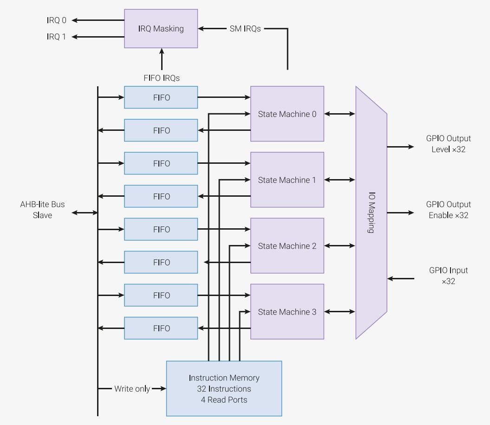

## PIO概要

RP2040 有两个完全相同的 PIO 块。每个 PIO 块都独立连接到总线、GPIO 和中断控制器。一个 PIO 块的结构图如下图所示。

| ] |
|:--:|
| 图38. PIO 块结构图。RP2040 有两个 PIO 块，每个块有四个状态机。四个状态机可以从一片共享指令内存中同时执行指令。FIFO 数据队列负责在 PIO 和系统之间缓冲传输的数据。每个状态机可以通过 GPIO 映射逻辑监视并操作最多 30 个 GPIO。|

可编程输入输出块（PIO）是一个非常灵活的硬件接口。它能支持许多 IO 标准，例如：

- 8080 和 6800 并行总线
- I2C
- 3针 I2S
- SDIO
- SPI、DSPI、QSPI
- UART
- DPI 或 VGA（通过电阻式DAC）

PIO 的编程方式与处理器类似。两个 PIO 块，每个有四个状态机，这些都可以独立执行顺序代码，来操作 GPIO 并传输数据。但不同于通用处理器，PIO 状态机是专门为输入输出设计的，因此具有确定性、精确的时间，并与固定功能的硬件紧密结合。
每个状态机都拥有以下机构：

- 两个 32 位移位寄存器 - 可以向任意方向位移任意比特
- 两个 32 位可擦写寄存器（scratch registor）
- 每个方向上（TX/RX）都有 4x32 位总线 FIFO，可以重新配置为单向 8x32 FIFO
- 可分割时钟分割器（16 整数，8 个分数位）
- 灵活的 GPIO 映射
- DMA 接口，每个时钟周期最多可维持来自系统 DMA 的 1 个字
- IRQ 标志设置/清除/状态查询

每个状态机及其相应的支撑硬件占用的芯片面积大约相当于标准的串行接口，如 SPI 或 I2C 控制器等。但是，PIO 状态机可以动态配置或重新配置，实现多种不同的接口。

状态机能用软件形式编程，而不是像 CPLD 那样采用完全可配置的逻辑芯片，就能在同样的成本和功耗下提供更多的硬件接口。它还带来了人们更为熟悉的编程模型，和更简单的工具流程，
因此人们可以利用 PIO 的灵活性直接进行编程，而不需要使用 PIO 库中事先定义好的接口。

PIO 不仅非常灵活，性能还非常高，这都要归功于每个状态机中的固定功能的硬件。在输出 DPI 时，PIO 能够在 48MHz 系统时钟的支持下，在活跃的扫描线期间提供 360Mb/s 的吞吐量。
在这个例子中，一个状态机负责处理帧和扫描线的时间，并生成像素时钟，另一个负责处理像素数据，并解包行程编码的扫描线。

状态机的输入和输出可以映射到最多 32 个 GPIO 上（在 RP2040 中限制为 30 个 GPIO），所有状态机都能独立、同时访问任何 GPIO。例如，标准的 UART 代码允许 TX、RX、CTS 和 RTS 使用任意四个 GPIO，
而 I2C 也允许将 SDA 和 SCL 映射到任意 GPIO 上。具体的自由度取决于 PIO 程序使用 PIO 针脚映射资源的方式，但至少，一个接口可以在一定数量的 GPIO 范围内自由移动。

