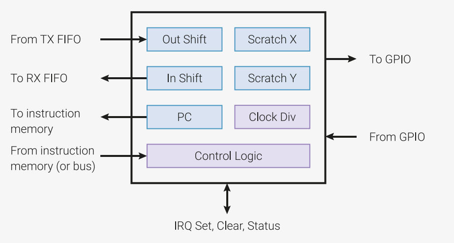
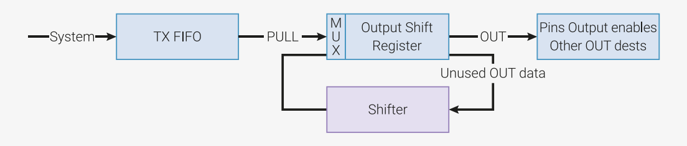
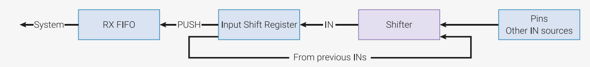

## 3.2. PIO 程序

四个状态机执行共享指令内存的程序。系统软件将内存加载至该区域，配置状态机和 IO 映射，然后将状态机设置为运行状态。PIO 程序可以来自多个地方：
可以由用户直接汇编，可以来自 PIO 库，或者由用户的软件生成。

之后，状态机就会自动运行，系统软件通过 DMA、中断和控制寄存器与之交互，就像操作 RP2040 上的其他外设一样。
对于更复杂的接口，PIO 提供了一个短小灵活的指令集，可以让系统软件更深入地操作状态机的控制流。

|  |
|:--:|
| 图39. 状态机概览。数据通过一对 FIFO 流入流出。状态机执行一段程序，在这些 FIFO、一系列内部寄存器和管脚之间传输数据。时钟分割器可以按照常数因子降低状态机的执行速度。 |


### 3.2.1. PIO 程序


PIO 状态机执行短小的二进制程序。

PIO 库提供了像 UART、SPI 或 I2C 等通用接口的程序，因此许多情况下不需要自己编写 PIO 程序。但是，直接对 PIO 编程可以带来更大的灵活性，
支持许多连设计者都没有考虑供的接口。

PIO 一共有九条指令：`JMP`、`WAIT`、`IN`、`OUT`、`PUSH`、`PULL`、`MOV`、`IRQ` 和 `SET`。关于每条指令的详细信息请参见[3.4节](section3-4.md)。

尽管 PIO 只有九条指令，手工编写二进制 PIO 程序也非常困难。PIO 汇编是用文本形式描述的 PIO 程序，每条命令对应于二进制程序中的一条指令。
下面是一个 PIO 汇编程序的例子：

<caption>Pico 示例：https://github.com/raspberrypi/pico-examples/tree/master/pio/squarewave/squarewave.pio 行7-12 </caption>

```
 7 .program squarewave
 8     set pindirs, 1 ; Set pin to output
 9 again:
10     set pins, 1 [1] ; Drive pin high and then delay for one cycle
11     set pins, 0 ; Drive pin low
12     jmp again ; Set PC to label `again`
```

SDK 自带了 PIO 汇编器，名为 `pioasm`。该程序接受一个 PIO 汇编程序的文本文件，其中可以包含多个程序，并输出汇编后的程序。
这些汇编后的程序以 C 头文件的形式输出，头文件中包含了常量数组。更多信息请参考[3.3节](section3-3.md)。


### 3.2.2. 控制流

在每个时钟周期，每个状态机获取、解码并执行一条指令。每个指令精确地占用一个时钟周期，除非它显式地暂停执行（如 `WAIT` 指令）。
每条指令还可以带有最多 31 个周期的延时，推迟下一条指令的执行，用于编写精确时钟周期的程序。

程序计数器 `PC` 指向当前周期正在执行的指令的内存地址。一般而言，`PC` 每个周期加一，到达指令内存边界时自动返回开头。
跳转指令是一个例外，它显式提供了 `PC` 的下一个值。

上一节的示例汇编程序（开头为 `.program squarewave`）演示了这两个概念。它在一个 GPIO 引脚上产生占空比为 50% 的方波，每个周期占用四个时钟周期。
通过其他手段（如 side-set）可以将周期缩短至两个时钟周期。

**注意**：Side-set 可以让状态机在执行一条指令时，顺便设置少量 GPIO 的状态。详细描述请参见[3.5.1节](section3-5.md#351-side-set)。

系统对指令内存拥有只写的权限，用于加载程序：

<caption>Pico示例：https://github.com/raspberrypi/pico-examples/tree/master/pio/squarewave/squarewave.c 行34-38</caption>

```c
34     // Load the assembled program directly into the PIO's instruction memory.
35     // Each PIO instance has a 32-slot instruction memory, which all 4 state
36     // machines can see. The system has write-only access.
37     for (int i = 0; i < count_of(squarewave_program_instructions); ++i)
38         pio->instr_mem[i] = squarewave_program_instructions[i];
```

时钟分割器可以将状态机的执行速度降低一个常数因子，该因子用一个 16.8 的定点分数表示。在上述示例中，如果采用的时钟分割因子为 2.5，
那么方波的周期就是 4 x 2.5 = 10 个时钟周期。这在需要设置 UART 等串行接口的精确波特率时非常有用。


<caption>Pico示例：https://github.com/raspberrypi/pico-examples/tree/master/pio/squarewave/squarewave.c 行42-47</caption>

```c
42     // Configure state machine 0 to run at sysclk/2.5. The state machines can
43     // run as fast as one instruction per clock cycle, but we can scale their
44     // speed down uniformly to meet some precise frequency target, e.g. for a
45     // UART baud rate. This register has 16 integer divisor bits and 8
46     // fractional divisor bits.
47     pio->sm[0].clkdiv = (uint32_t) (2.5f * (1 << 16));
```

上述代码片段所在的整个程序可以在 GPIO 0 （或任何管脚）上产生一个 12.5MHz 的方波。我们还可以使用 `WAIT PIN` 指令根据管脚状态等待一定时间，
或使用 `JMP PIN` 指令根据管脚状态跳转，实现根据管脚状态改变控制流。

<caption>Pico示例：https://github.com/raspberrypi/pico-examples/tree/master/pio/squarewave/squarewave.c 行51-59

```c
51     // There are five pin mapping groups (out, in, set, side-set, jmp pin)
52     // which are used by different instructions or in different circumstances.
53     // Here we're just using SET instructions. Configure state machine 0 SETs
54     // to affect GPIO 0 only; then configure GPIO0 to be controlled by PIO0,
55     // as opposed to e.g. the processors.
56     pio->sm[0].pinctrl =
57         (1 << PIO_SM0_PINCTRL_SET_COUNT_LSB) |
58         (0 << PIO_SM0_PINCTRL_SET_BASE_LSB);
59     gpio_set_function(0, GPIO_FUNC_PIO0);

```

系统可以通过 CTRL 寄存器在任意时间启动或停止任意状态机。多个状态机可以同时启动，而 PIO 的确定性能保证它们之间的完美同步。

<caption>Pico示例：https://github.com/raspberrypi/pico-examples/tree/master/pio/squarewave/squarewave.c 行63-67</caption>

```c
63     // Set the state machine running. The PIO CTRL register is global within a
64     // PIO instance, so you can start/stop multiple state machines
65     // simultaneously. We're using the register's hardware atomic set alias to
66     // make one bit high without doing a read-modify-write on the register.
67     hw_set_bits(&pio->ctrl, 1 << (PIO_CTRL_SM_ENABLE_LSB + 0));
```

大多数指令都来自指令内存，但指令也可以来自其他地方，并且可以混合使用：

- 写入特殊配置寄存器（`SMx INSTR`）的指令会立即执行，中断其他指令的执行。例如，写入 `SMx INSTR` 的一条 `JMP` 指令会让状态机立即从另一个位置开始执行。
- 使用 `MOV EXEC` 指令，可以从寄存器执行指令。
- 使用 `OUT EXEC` 指令，可以从输出移位寄存器中执行指令。

后面几种方式非常灵活：指令可以嵌入到传递给 FIFO 的数据流中。I2C 的示例就在正常的数据中嵌入了 `STOP` 和 `RESTART` 等的条件。对于 `MOV` 和 `OUT EXEC` 来说，
`MOV` / `OUT` 本身需要一个时钟周期，然后再执行指定的指令。


### 3.2.3. 寄存器

每个状态机都拥有几个内部寄存器。这些寄存器用于保存输入或输出数据，以及循环变量等临时数据。

#### 3.2.3.1. 输出移位寄存器（OSR）

|  |
|:--:|
| 图40. 输出移位寄存器（OSR）。数据每次可以并行输出 1 ~ 32 比特，未使用的数据由一个双方向移位器负责回收。当 OSR 寄存器为空时，它会从 TX FIFO 中加载数据。

输出移位寄存器（OSR）负责存储并在 TX FIFO 和管脚（或其他目的地，如可擦写寄存器）之间移位输出数据。


- `PULL` 指令：从 TX FIFO 中移除一个 32 位字并置于 OSR 中。
- `OUT` 指令将 OSR 中的数据移位至其他目的地，一次可移位 1 ~ 32 比特。
- 当数据被移位出后，OSR 会填充为零。
- 如果启用自动加载（autopull），那么在达到某个移位阈值时，状态机会在执行 `OUT` 指令时，自动从 FIFO 加载数据到 OSR。
- 移位方向可以是左或右，由处理器通过配置寄存器进行设置。

例如，以每两个时钟周期一个字节的速率，将数据通过 FIFO 传输到管脚：

```
1 .program pull_example1
2 loop:
3     out pins, 8
4 public entry_point:
5     pull
6     out pins, 8 [1]
7     out pins, 8 [1]
8     out pins, 8
9     jmp loop

```

在绝大部分情况下，可以通过自动加载（autopull，参见[3.5.4节](section3-5.md#354-TODO)）功能，当状态机试图在空的 OSR 上执行 `OUT` 指令时，由硬件自动填充 OSR。这样做有两个好处：

- 节省一条从 FIFO 加载数据的指令
- 实现更高的吞吐量，只要 FIFO 有数据，就能以每时钟周期最高 32 比特的数据输出

配置好自动加载后，上述程序可以简化如下，其行为完全相同：

```
1 .program pull_example2
2 
3 loop:
4     out pins, 8
5 public entry_point:
6     jmp loop
```

通过程序折返功能（program wrapping，参见[3.5.2节](section3-5.md#352-TODO)）还可以进一步简化程序，实现每个系统时钟周期输出 1 字节。

```
1 .program pull_example3
2 
3 public entry_point:
4 .wrap_target
5     out pins, 8 [1]
6 .wrap
```

#### 3.2.3.2. 输入移位寄存器（ISR）

|  |
|:--:|
| 图41. 输入移位寄存器（ISR）。数据每次进入 1 ~ 32 比特，当前内容会左移或右移，以腾出空间。当寄存器满时，内容会被写入 RX FIFO。 |

- `IN` 指令每次将 1 ~ 32 比特的数据移位进寄存器。
- `PUSH` 指令将 ISR 的内容写入 RX FIFO。
- 执行推出（push）时，ISR 的内容被清零。
- 如果设置了自动推出（autopush），那么当达到某个移位阈值时，状态机会在执行 `IN` 指令时自动将 ISR 的内容推出。
- 移位方向可以由处理器通过配置寄存器进行设置。


#### 3.2.3.3. 移位计数器

状态机会记录总共有多少比特通过 `OUT` 指令移出了 OSR 寄存器，以及通过 `IN` 指令移入了 ISR。这个信息由一对硬件计数器负责跟踪，即输出移位计数器和输入移位计数器，
每个计数器可以保存数字 0 到 32（包含 0 和 32）。在每次移位操作后，相应的计数器会增加移位数量，最多增加 32（等于移位寄存器的宽度）。
可以对状态机进行配置，在某个计数器达到一定阈值后自动执行下列某个动作：

- 当特定数量的比特被移出后，自动加载 OSR。参见[3.5.4节](section3-5.md#TODO)
- 当特定数量的比特被移入后，自动清空 ISR。参见[3.5.4节](section3-5.md#TODO)
- `PUSH` 或 `PULL` 指令根据输入或输出移位计数器的条件自动执行

在 PIO 复位时，或在 `CTRL_SM_RESTART` 时，输入一位计数器被清为 0（表示没有任何比特被移入），输出移位寄存器被初始化为 32（表示全空，没有任何等待移出的比特）。
影响移位计数器的其他指令包括：

- 成功的 `PULL` 会将输出移位计数器清为 0
- 成功的 `PUSH` 会将输入移位计数器清为 0
- `MOV OSR, ...` （即任何写入 `OSR` 的 `MOV` 指令）会将输出移位计数器清为 0
- `MOV ISR, ...` （即任何写入 `ISR` 的 `MOV` 指令）会将输入移位计数器清为 0
- `OUT ISR, count` 将输入移位计数器设置为 `count`

#### 3.2.3.4. 可擦写寄存器

每个状态机有两个 32 位内部可擦写计数器（scratch registor），名为 `X` 和 `Y`。

它们可以用于：

- `IN`/`OUT`/`SET`/`MOV`指令的源或目的地
- 分支条件的源

例如，假设我们要为比特 "1" 产生一个长脉冲，为比特 "0" 产生一个短脉冲：

```
 1 .program ws2812_led
 2 
 3 public entry_point:
 4     pull
 5     set x, 23       ; Loop over 24 bits
 6 bitloop:
 7     set pins, 1     ; Drive pin high
 8     out y, 1 [5]    ; Shift 1 bit out, and write it to y
 9     jmp !y skip     ; Skip the extra delay if the bit was 0
10     nop [5]
11 skip:
12     set pins, 0 [5]
13     jmp x-- bitloop ; Jump if x nonzero, and decrement x
14     jmp entry_point
```

这里 `X` 是循环计数器，`Y` 是临时变量，根据来自 OSR 的一个比特进行分支。该程序可以用来驱动 WS2812 LED 接口，不过该程序还可以写得更紧凑（最少只需要三条指令）。

通过 `MOV` 指令，可擦写寄存器可以用来保存或恢复移位寄存器，可以用于重复移出同样的序列等情况。

**注意**：更紧凑的 WS2812 示例（共四条指令）参见[3.6.2节](section3-6.md#TODO)。


#### 3.2.3.5. FIFO

每个状态机都拥有一对 4 字深的 FIFO，一个用于将数据从系统传输到状态机（TX），另一个用于将数据从状态机传输至系统（RX）。TX FIFO 由总线管理者（如处理器或 DMA 控制器）负责写入，
而 RX FIFO 由状态机写入。FIFO 解耦合了 PIO 状态机和系统总线之间的时序，让状态机在没有处理器介入的情况下工作更长时间。

FIFO 还会生成数据请求信号（DREQ），系统的 DMA 控制器可以借助此信号，根据 RX FIFO 中的数据情况，或 TX FIFO 中的空闲空间情况，采取适当的读写节奏。
因此，处理器可以设置更长的事务，比如允许在没有处理器介入的情况下传输几 K 字节的数据。

通常，一个状态机只需要单方向传递数据。此时，`SHIFTCTRL_FJOIN` 选项可以将两个 FIFO合并成一个 8 字深的单向 FIFO。这个特性可以用于高带宽的接口，如 DPI。


### 3.2.4. 等待状态


状态机可能由于多种原因暂停执行：

- `WAIT` 指令的条件未满足
- 阻塞的 `PULL` 指令遇到 TX FIFO 为空的情况，或阻塞的 `PUSH` 指令遇到 RX FIFO 为满的情况
- `IRQ WAIT` 指令设置了 IRQ 标志，等待其清空
- `OUT` 指令遇到启用了自动加载，OSR 达到移位阈值，且 TX FIFO 为空的情况
- `IN` 指令遇到启用了自动推出，ISR 达到以为预制，且 RX FIFO 为满的情况

此时，程序计数器不会增加，状态机会在下一个周期继续执行当前指令。如果指令带有一定数量的延时，那么在暂停执行状态解除之前，延时不会被执行。

**注意**：Side-set（参见[3.5.1节](section3-5.md#TODO)）不受暂停执行的影响，永远发生在所属指令的第一个时钟周期。


### 3.2.5. 管脚映射

PIO 可以控制最多 32 个 GPIO 的输出电平和方向，以及观察它们的输入电平。在每个系统时钟周期，每个状态机可以进行零个、一个或两个以下操作：

- 通过一条 `OUT` 或 `SET` 指令改变某些 GPIO 的电平或方向，或通过一条 `IN` 指令读取某些 GPIO
- 通过一个 side-set 操作改变某些 GPIO 的电平或方向

每个操作都可以指定连续的一段 GPIO 管脚，管脚数量和起始管脚由每个状态机的 `PINCTRL` 寄存器控制。共可以设定四个范围，分别用于 `OUT`、`SET`、
`IN` 和 side-set 操作。每个范围可以覆盖给定 PIO 块内的任意数量的 GPIO （在 RP2040 上为 30 个用户定义 GPIO），而且这些范围之间可以重叠。

对于每次 GPIO 输出（电平和方向分别考虑），PIO 会考虑该时钟周期内发生的所有 8 个写入操作，并从编号最大的状态机开始应用写入操作。
如果同一个状态机在同一个 GPIO 上同时执行 `SET`/`OUT` 和 side-set 操作，则采用 side-set。如果没有任何状态机写入某个 GPIO 输出，
则其值保持前一个周期的值不变。

一般而言，每个状态机的输出被映射到不同的 GPIO 组上，从而实现某种并行接口。


### 3.2.6 IRQ 标志

IRQ 标志是可以由状态机或系统进行设置或清除的状态位。共有 8 个标志，全部对所有状态机可见，而且还可以通过 `IRQ0_INTE` 和 `IRQ1_INTE` 控制寄存器，
将 IRQ 标志的低 4 比特遮盖成某个 PIO 的中断请求线，

IRQ 标志的用途主要有两个：

- 在状态机程序中，判断系统级别的中断，然后据此等待某个中断的应答
- 同步两个状态机的执行

状态机可以通过 `IRQ` 和 `WAIT` 指令来处理 IRQ 标志。


### 3.2.7. 状态机之间的交互

指令内存是一个 1-写 4-读的寄存器文件，所以四个状态机可以在同一个周期读取指令，而不需要相互等待。

使用多个状态机有三种方式：

- 将多个状态机指向同一个程序
- 将多个状态机指向不同的程序
- 用多个状态机运行同一个接口的不同部分，例如 UART 的 TX 端和 RX 端，或 DPI 显示的时钟/水平同步和像素数据

状态机之间无法进行数据通信，但可以通过 IRQ 标志互相同步。共有 8 个 IRQ 标志（低 4 比特可以遮盖，用于系统 IRQ），
每个状态机可以通过 `IRQ` 指令设置或清除任意标志，也可以通过 `WAIT IRQ` 指令等待某个标志被设置或清除。
这样可以实现状态机之间的时钟周期级别的同步。


