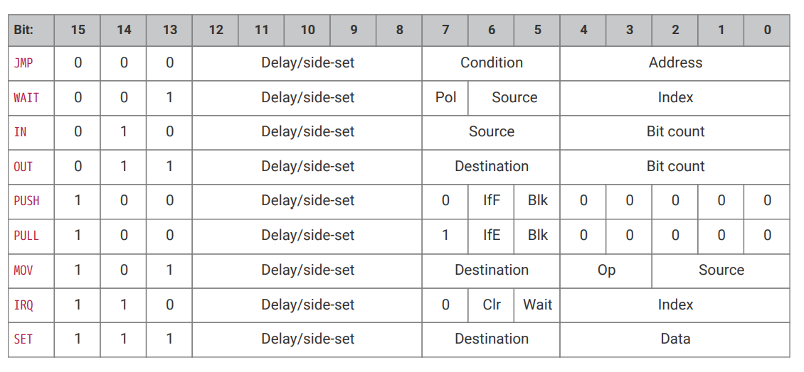
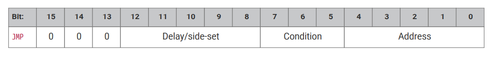
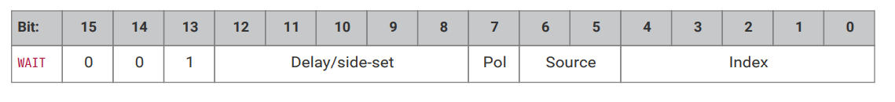
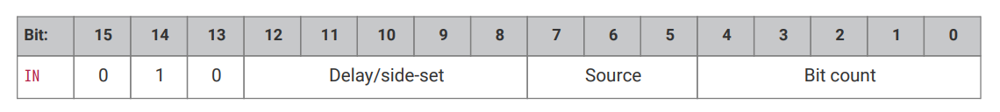
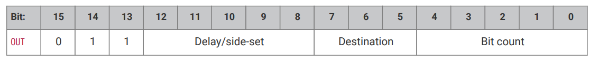
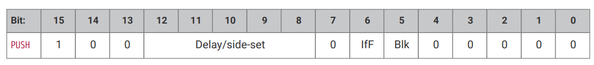
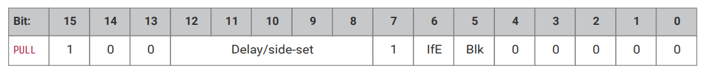
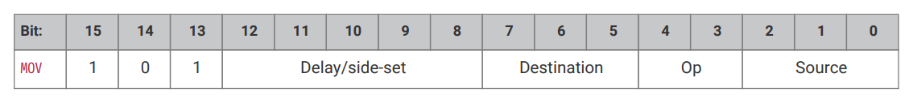
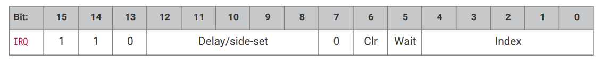
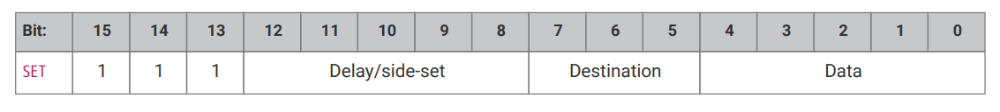

## 3.4. 指令集

### 3.4.1. 概要

PIO 指令为 16 位，编码方式如下：

所有 PIO 指令的执行时间都是一个时钟周期。

5 比特的 `Delay/side-set` 字段的含义依赖于状态机的 `SIDESET_COUNT` 配置：

- 最多 5 个 LSB 比特（5 减 `SIDESET_COUNT`）为当前指令和下一条指令之间插入的空闲周期数。
- 最多 5 个 MSB 比特（由 `SIDESET_COUNT` 设置）为 side-set（参见[3.5.1节](section3-5.md#351-side-set)），可以在该指令执行的同时，将某些 GPIO 管脚设置为某个常量。

### 3.4.2. JMP

#### 3.4.2.1. 编码

#### 3.4.2.2. 操作

如果 `Condition` 为真，则将程序计数器设置为 `Address`，否则无操作。

`JMP` 上的延时周期不论 `Condition` 是否为真都会生效。延时在 `Condition` 被求值、程序计数器被更新后进行。

- Condition：
  - 000：（无条件）：永远跳转
  - 001：`!X`：当寄存器 X 为零时
  - 010：`X--`：当 X 非零时。判断后进行减一
  - 011：`!Y`：当寄存器 Y 为零时
  - 100：`Y--`：当 Y 非零时。判断后进行减一
  - 101：`X!=Y`：当 X 不等于 Y 时
  - 110：`PIN`：根据输入管脚跳转
  - 111：`!OSRE`：当输出移位寄存器非空时
- Address：要跳转到的指令地址。在指令编码中，该值为 PIO 指令内存中的绝对地址。

`JMP PIN` 会根据 `EXECCTRL_JMP_PIN` 选择的 GPIO 管脚进行跳转。`EXECCTRL_JMP_PIN` 是一个可配置选项，它从状态机可以使用的最多 32 个 GPIO 输入管脚中选择其中之一，供 JMP 使用。不依赖于状态机的其他输入映射。
如果该 GPIO 为高电平，则跳转。

`!OSRE` 将自上一次 `PULL` 以来移出的比特数，与移位计数阈值进行比较。移位计数阈值由 `SHIFTCTRL_PULL_THRESH` 配置。自动加载（autopull，参见[3.5.4节](section3-5.md#354-自动推出和自动加载)）也通过该配置项配置。

`JMP X--` 和 `JMP Y--` 总是会将寄存器 X 或 Y 减一。减一操作与可擦写寄存器的当前值无关。跳转条件是寄存器的*初始值*，即减一操作发生之前的值。如果寄存器最初为非零值，则发生跳转。

#### 3.4.2.3. 汇编语法

`jmp (<cond>) <target>`

其中：

`<cond>` 是上节列出的可选的条件（例如，`!x` 表示可擦写寄存器 X 为零）。如果未指定条件，则总是跳转。

`<target>` 是一个程序标签或值（参见[3.3.2节](section3-3.md#332-值))，表示程序内部的指令偏移量（第一条指令的偏移量为 0）。注意，由于 PIO JMP 指令使用 PIO 指令内存之内的绝对地址，JMP 需要在运行时根据程序的加载偏移量进行调整。
这一步在加载程序时由 SDK 负责，但在编码 JMP 指令供 `OUT EXEC` 使用时需要留意这一点。

### 3.4.3. WAIT

#### 3.4.3.1. 编码

#### 3.4.3.2. 操作

等待，直到条件满足。

与所有等待指令一样（参见[3.2.4节](section3-2.md#324-等待状态)），延时周期在指令*完成*之后发生。也就是说，如果指定了延时周期，那么延时要直到等待条件满足*之后*才会开始。

- Polarity
  - 1：等待 1。
  - 0：等待 0。
- Source：指定要等待什么。可能的值有：
  - 00:`GPIO`：等待由 `Index` 选择的系统 GPIO 输入。该项为绝对 GPIO 索引，不受状态机的输入 IO 映射影响。
  - 01：`PIN`：由 `Index` 指定的输入管脚。首先会应用当前状态机的输入 IO 映射，然后利用 `Index` 选择要等待哪个输入比特。换句话说，选择的管脚就是 `PINCTRL_IN_BASE` 加上 `Index`，再对 32 取余。
  - 10：`IRQ`：等待由 `Index` 选择的 PIO IRQ 标志。
  - 11：保留
- Index：要检查哪个管脚或比特。

`WAIT x IRQ` 的行为与其他 `WAIT` 源略有不同：

- 如果 `Polarity` 为 1，则在等待条件满足后，当前状态机会清除选择的 IRQ 标志。
- 标志位索引的解码方式与 `IRQ` 的索引字段相同：如果 MSB 被设置，则将状态机的 ID（0..3）加到 IRQ 索引上，加法采用两个 LSB 的模 4 加法。例如，状态机 2、标志值为 '0x11'，则等待标志 3，而标志值 '0x13' 将等待标志 1。这样，运行同一个程序的多个状态机就可以互相同步。

**注意** `WAIT 1 IRQ x` 不应当使用供中断控制器使用的 IRQ 标志，以避免与系统中断处理函数的竞合冲突。

#### 3.4.3.3. 汇编语法

`wait <polarity> gpio <gpio_num>`

`wait <polarity> pin <pin_num>`

`wait <polarity> irq <irq_num> (rel)`

其中：

`<polarity>` 是一个值（参见[3.3.2节](section3-3.md#332-值)），指定极性（0 或 1）

`<pin_num>` 是一个值（参见[3.3.2节](section3-3.md#332-值)），指定输入管脚的编号（在状态机输入管教映射中的编号）

`<gpio_num>` 是一个值（参见[3.3.2节](section3-3.md#332-值)），指定实际的 GPIO 管脚编号

`<irq_num> (rel)` 是一个值（参见[3.3.2节](section3-3.md#332-值)），指定要等待的 IRQ 编号（0 ~ 7）。如果设置了 `rel`，则实际的 IRQ 编号的计算方式为，将 IRQ 编号的最低两个比特（`irq_num`10）替换成和的最低两个比特（`irq_num`10 + `sm_num`10），其中 `sm_num`10 为状态机编号

### 3.4.4. IN

#### 3.4.4.1. 编码

#### 3.4.4.2. 操作

从 `Source` 移位 `Bit count` 个比特到输入移位寄存器（ISR）中。移位方向由各个状态机的 `SHIFTCTRL_IN_SHIFTDIR` 决定。此外，增加输入移位计数器 `Bit count`，最大到 32。

- Source：
  - 000：`PINS`
  - 001：`X`（可擦写寄存器 X）
  - 010：`Y`（可擦写寄存器 Y）
  - 011：`NULL`（全零）
  - 100：保留
  - 101：保留
  - 110：`ISR`
  - 111：`OSR`
- Bit count：要将多少比特移位到 ISR。值为 1 ~ 32 比特，32 编码为 `00000`。

如果启用了自动推出（autopush），那么当达到推出阈值（`SHIFTCTRL_PUSH_THRES`）时，`IN` 还会将 ISR 的内容推出到 RX FIFO。不论自动推出是否发生，`IN` 的执行时间都是一个时钟周期。
当自动推出发生，但 RX FIFO 满时，状态机会进入等待状态。自动推出会清空 ISR 的内容为全零，并且会清除输入移位计数器。参见[3.5.4节](section3-5.md#354-自动推出和自动加载)。

`IN` 永远使用源数据的最低 `Bit count` 个比特。例如，如果 `PINCTRL_IN_BASE` 设置为 5，那么指令 `IN 3, PINS` 会读取管脚 5、6 和 7，并将这些值移入 ISR。
首先，ISR 会左移或右移，为新的输入数据腾出空间，然后将输入数据复制到腾出的空间中。输入数据的比特顺序与移位方向无关。

使用 `NULL` 可以移位 ISR 的内容。例如，UART 会首先接受 LSB，因此必须右移。在执行 8 次 `IN PINS, 1` 指令后，输入的串行数据占据了 ISR 的 31..24 比特。
此时，`IN NULL, 24` 指令将会移入 24 个零比特，将输入数据移到 ISR 的 7..0 比特。另一种方式是让处理器或 DMA 从 FIFO 地址 +3 的位置读取一个字节，
这样可以读取 FIFO 内容的 31..24 比特。

#### 3.4.4.3. 汇编语法

`in <source>, <bit_count>`

其中：

`<source>` 是上述源之一。

`<bit_count>` 是一个值（参见[3.3.2节](section3-3.md#332_值)，指定了要移位的比特数（有效值为 1 ~ 32）。

### 3.4.5. OUT

#### 3.4.5.1. 编码

#### 3.4.5.2. 操作

将 `Bit count` 个比特移出输入移位寄存器（OSR），并写入 `Destination`。此外，还会增加输出移位计数器 `Bit count`，直到最大值 32。

- Destination：
  - 000：`PINS`
  - 001：`X`（可擦写寄存器 X）
  - 010：`Y`（可擦写寄存器 Y）
  - 011：`NULL`（全零）
  - 100：`PINDIRS`
  - 101：`PC`
  - 110：`ISR`（同时设置 ISR 移位计数器为 `Bit count`）
  - 111：`EXEC`（将 OSR 的移位数据作为指令执行）
- Bit count：要从 OSR 移出多少比特。值为 1..32 比特，32 编码为 `00000`。

将一个 32 位值写入 `Destination`：低 `Bit count` 个比特来自 OSR，其余为零。如果 `SHIFTCTRL_OUT_SHIFTDIR` 为右，则该值为 OSR 的最低 `Bit count` 比特，否则为最高 `Bit count` 比特。

`PINS` 和 `PINDIRS` 使用 `OUT` 的管脚映射，参见[3.5.6节](section3-5.md#356-gpio-映射)。

如果启用自动加载（autopull），那么如果达到了加载阈值 `SHIFTCTRL_PULL_THRESH`，则自动从 TX FIFO 填充 OSR。同时输出移位计数器清零。在这种情况下，如果 TX FIFO 为空，则 `OUT` 会进入等待状态，
但执行时间仍然为一个时钟周期。详情参考[3.5.4节](section3-5.md#354-自动推出和自动加载)。

有了 `OUT EXEC`，指令就可以放在 FIFO 数据流中。`OUT` 本身的执行需要一个时钟周期，然后下一个周期执行来自 OSR 的指令。该机制能执行的指令类型没有限制。最初的 `OUT` 指令的延时周期将被忽略，
但之后执行的指令可以正常插入延时周期。

`OUT PC` 相当于无条件跳转到 OSR 移出的值对应的地址。

#### 3.4.5.3. 汇编语法

`out <destination>, <bit_count>`

其中：

`<destination>` 是上述目的地之一。

`<bit_count>` 是一个值（参见[3.3.2节](section3-3.md#332-值)，指定要移位的比特数（有效值为 1 ~ 32）。

### 3.4.6. PUSH

#### 3.4.6.1. 编码

#### 3.4.6.2. 操作

将 ISR 的内容作为一个 32 位字推出到 RX FIFO。同时将 ISR 清除为全零。

- `IfFull`：如果设置为 1，那么在输入移位计数器未达到阈值（`SHIFTCTRL_PUSH_THRESH`，与自动推出用的是同一个选项；参见[3.5.4节](section3-5.md#354-自动推出和自动加载)），则什么都不做。
- `Block`：如果设置为 1，那么在 RX FIFO 为满时，暂停执行。

`PUSH IFFULL` 也能像自动推出（autopush）那样让程序更紧凑。如果启用了自动推出，会导致 `IN` 在不恰当的时候陷入等待状态，比如状态机需要在此时判断某种外部控制信号，那么 `PUSH IFFULL` 就能派上用场了。

PIO 汇编器会默认设置 `Block` 位。如果 `Block` 位没有设置，则 `PUSH` 不会在 RX FIFO 满的情况下进入等待，而是会继续立即执行下一条指令。此时，FIFO 的状态和内容不变。ISR 仍被清空为全零，
同时设置 `FDEBUG_RXSTALL` 标志（与 RX FIFO 满时进行阻塞 `PUSH` 或自动推出相同），表示数据已经丢失。

#### 3.4.6.3. 汇编语法

`push (iffull)`

`push (iffull) block`

`push (iffull) nonblock`

其中：

`iffull` 相当于上述 `IfFull == 1`。也就是说，不指定的情况下，默认值为 `IfFull == 0`

`block` 相当于上述 `Block == 1`。如果不指定 `block` 或 `noblock`，则此值为默认值

`noblock` 相当于上述 `Block == 0`。

### 3.4.7. PULL

#### 3.4.7.1. 编码

#### 3.4.7.2. 操作

从 TX FIFO 加载一个 32 位字到 OSR 中。

- `IfEmpty`：如果为 1，那么在输出移位计数器达到阈值（`SHIFTCTRL_PULL_THRESH`，与自动加载用的是同一个选项；参见[3.5.4节](section3-5.md#354-自动推出和自动加载)），则什么都不做。
- `Block`：如果设置为 1，那么在 TX FIFO 为空时，暂停执行。如果为 0，那么从空的 FIFO 中加载，将会把可擦写寄存器 X 的内容复制到 OSR。

一些外设（UART、SPI等）应当在无数据时等待，有数据时进行加载；而另一些（I2S）则应当继续执行，而且最好是继续输出占位数据，或重复数据。这个行为可以通过 `Block` 参数实现。

在空的 FIFO 上执行不阻塞的 `PULL` 相当于执行 `MOV OSR, X`。程序可以事先在寄存器 X 中加载适当的默认值，或在每次 `PULL NOBLOCK` 之后执行一次 `MOV X, OSR`，从而重复上一个有效的 FIFO 字，直到新的数据出现。

如果在启用自动加载时，当 TX FIFO 为空时的 `OUT` 会导致程序在不恰当的地方等待，就能用 `PULL IFEMPTY` 解决问题。`IfEmpty` 可以像自动加载一样简化一些程序，例如可以去掉外层循环计数器，但是它能够控制暂停的发生位置。

**注意** 当启用自动加载时，在 OSR 满的情况下任何 `PULL` 指令都是误操作，所以 `PULL` 指令可以作为一种屏障。`OUT NULL, 32` 可以显式地抛弃 OSR 的内容。更多细节参见[3.5.4.2节](section3-5.md#354-自动推出和自动加载)。

#### 3.4.7.3. 汇编语法

`pull (ifempty)`

`pull (ifempty) block`

`pull (ifempty) noblock`

其中：

`ifempty` 相当于上述 `IfEmpty == 1`，即如果没有指定，则默认值为 `IfEmpty == 0`

`block` 相当于上述 `Block == 1`。如果不指定 `block` 或 `noblock`，则此值为默认值

`noblock` 相当于上述 `Block == 0`。

### 3.4.8. MOV

#### 3.4.8.1. 编码

#### 3.4.8.2. 操作

从 `Source` 复制数据到 `Destination`。

- Destination：
  - 000：`PINS`（使用与 `OUT` 相同的管脚映射）
  - 001：`X`（可擦写寄存器 X）
  - 010：`Y`（可擦写寄存器 Y）
  - 011：保留
  - 100：`EXEC`（将数据作为指令执行）
  - 101：`PC`
  - 110：`ISR`（该操作会重置输入移位计数器为零，意为空）
  - 111：`OSR`（该操作会重置输出移位寄存器为零，意为满）
- Operation：
  - 00：无
  - 01：求反（按位求补）
  - 10：反转比特顺序
  - 11：保留
- Source：
  - 000：`PINS`（使用与 `IN` 相同的管脚映射）
  - 001：`X`
  - 010：`Y`
  - 011：`NULL`
  - 100：保留
  - 101：`STATUS`
  - 110：`ISR`
  - 111：`OSR`

`MOV PC` 会导致无条件跳转。`MOV EXEC` 的效果和 `OUT EXEC`（参见[3.4.5节](#345-out)）相同，可以将寄存器的内容作为指令执行。
`MOV` 指令自身需要一个时钟周期，`Source` 中的指令在下一个周期执行。`MOV EXEC` 上的延时周期会被忽略，但被执行的指令可以带有延时周期。

源 `STATUS` 的值为全 1 或全 0，取决于某些状态机的状态，如 FIFO 满/空等。可以通过 `EXECCTRL_STATUS_SEL` 配置。

`MOV` 可以通过有限的几种方式操作传输的数据，由 `Operation` 参数指定。求反操作会将 `Destination` 中的每个比特设置为 `Source` 中对应比特的 NOT，
也就是说，1 变成 0，0 变成 1。至于反转比特顺序，如果将比特编号为 0 ~ 31 的话，该操作可以将 `Destination` 中的每个比特 n 设置为 `Source` 中的比特 31 - n。

#### 3.4.8.3. 汇编语法

`mov <destination>, (op) <source>`

其中：

`<destination>` 是上述目的地之一。

`<op>` 如果存在的话，为下列值之一：

- `!` 或 `~` 表示 NOT （注意：永远是按位求 NOT）
- `::` 表示反转比特顺序

`<source>` 是上述源之一。

### 3.4.9. IRQ

#### 3.4.9.1. 编码

#### 3.4.9.2. 操作

设置或清除由 `Index` 参数指定的 IRQ 标志。

- Clear：如果为 1，则清除 `Index` 指定的标志，否则设置标志。如果指定了 `Clear`，则忽略 `Wait` 比特。
- Wait：等待指定标志再次变成低，即，等待某个系统中断处理函数响应该标志。
- Index：
  - 3 个 LSB 比特指定一个 IRQ 索引，值为 0 ~ 7。根据 Clear 比特的值，该 IRQ 标志将被设置或清除。
  - 如果设置了 MSB，则将状态机ID（0 ~ 3）用模 4 的方式加到 IRQ 索引上，即结果是最低 2 比特。例如，状态机 2 设置标志值 0x11，将会设置 IRQ 3，而设置标志值 0x13 将会设置标志 1。

IRQ 标志 4 ~ 7 只能被状态机使用，而 IRQ 标志 0 ~ 3 可以作为系统级别的中断，在 PIO 的两个外部中断请求线之一上使用，具体采用哪个外部中断请求线，由 `IRQ0_INTE` 和 `IRQ1_INTE` 配置。

模 4 加法可以实现 IRQ 和 WAIT 指令的“相对寻址”，用于运行同一个程序的不同状态机之间的同步。比特 2 （第三个 LSB)不受此加法影响。

如果设置了 `Wait`，则 `Delay` 周期会等到等待期间结束后再开始。

#### 3.4.9.3. 汇编语法

`irq <irq_num> (_rel)`

`irq set <irq_num> (_rel)`

`irq nowait <irq_num> (_rel)`

`irq wait <irq_num> (_rel)`

`irq clear <irq_num> (_rel)`

其中：

`<irq_num> (_rel)` 是一个值（参见[3.3.2节](section3-3.md#332-值)），指定要等待的 IRQ 编号（0 ~ 7）。如果存在 `rel`，则实际的 IRQ 编号的计算方式为，将 IRQ 编号（`irq_num`10）的最低两比特替换为
（`<irq_num`10 + `sm_num`10）的最低两比特，其中 `sm_num`10 为状态机编号

`irq` 表示设置 IRQ，无需等待

`irq set` 也表示设置 IRQ，无需等待

`irq nowait` 还是表示设置 IRQ，无需等待

`irq wait` 表示设置 IRQ，然后等待 IRQ 被清除后再继续

`irq clear` 表示清除 IRQ

### 3.4.10. SET

#### 3.4.10.1. 编码

#### 3.4.10.2. 操作

将立即值 `Data` 写入到 `Destination`。

- Destination：
  - 000：`PINS`
  - 001：`X`（可擦写寄存器 X）5 个 LSB 比特写入 `Data`，其他比特清为 0。
  - 010：`Y`（可擦写寄存器 Y）5 个 LSB 比特写入 `Data`，其他比特清为 0。
  - 011：保留
  - 100：`PINDIRS`
  - 101：保留
  - 110：保留
  - 111：保留
- Data: 设置到管脚或寄存器的 5 比特的立即数。

该指令用于设置控制信号，如时钟或芯片选择，或初始化循环计数器。由于 `Data` 只有 5 比特，因此可擦写寄存器可以 `SET` 的值为 0 ~ 31，最大可循环 32 次。

`SET` 和 `OUT` 的管脚映射是独立配置的。它们可以映射到不同的位置，例如，一个管脚作为时钟信号使用，另一个作为数据使用。它们的管脚范围也可以重叠：
UART 传输程序可以使用 `SET` 来设置开始和终止比特，用 `OUT` 指令向同一个管脚上移出 FIFO 数据。

#### 3.4.10.3. 汇编格式

`set <destination>, <value>`

其中：

`<destination>` 为上述目的地之一。

`<value>` 是要设置的值（参见[3.3.2节](section3-3.md#332-值)），有效值为 0 ~ 31

