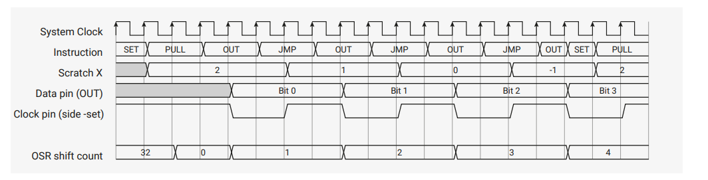
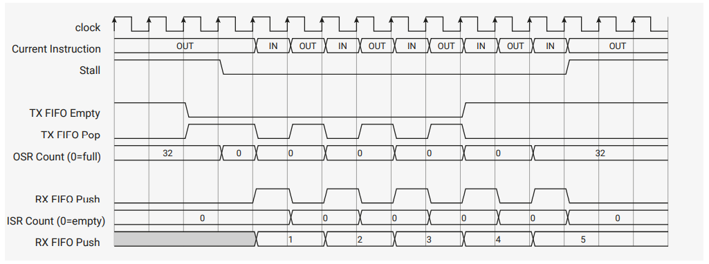

## 3.5. 功能详解


### 3.5.1. Side-set


Side-set 特性可以让状态机在执行主指令的同时，改变最多 5 个管脚的电平或方向。

需要使用 side-set 的例子之一就是高速 SPI 接口，其数据比特从 OSR 推出到 GPIO，而时钟信号转换（从 1 到 0， 或从 0 到 1）必须与此同时发生。
此时，一个带有 side-set 的 `OUT` 就能同时完成两项任务。

这样可以保证接口的时序更精确，减小整体的程序大小（因为不需要独立的 `SET` 指令设置时钟管脚），而且提高了 SPI 能支持的最大频率。

Side-set 还可以让 GPIO 映射更灵活，因为它的映射独立于 `SET` 的映射。示例 I2C 代码在禁止时钟拉伸（clock streching）的情况下，可以将 `SDA` 和 `SCL` 映射到任意管脚上。
正常情况下，SCL 反转用于同步数据传输，而 SDA 包含移出的数据比特。但是，一些特定的 I2C 序列，如 `Start` 和 `Stop` 线条件，需要在 SDA 和 SCL 上产生特定的脉冲。
I2C 通过如下映射来实现这一点：

- Side-set → SCL
- `OUT` → SDA
- `SET` → SDA

这样，状态机就可以在 SDA 上提供两种情况的数据，在 SCL 上提供时钟，或者同时在 SDA 和 SCL 上提供固定的转换，同时依然允许 SDA 和 SCL 被映射到任意两个 GPIO 上。

Side-set 数据编码到每条指令的 `Delay/side-set` 字段。任何指令都可以与 side-set 组合，包括 `OUT PINS`、`SET PINS` 等写入管脚的指令。Side-set 
的管脚映射独立于 `OUT` 和 `SET` 的映射，但它们可以重叠。如果 side-set 和 `OUT` 或 `SET` 同时写入同一个管脚，则采用 side-set 的数据。

**注意** 如果指令进入等待状态，side-set 依然会立即生效。

```
1 .program spi_tx_fast
2 .side_set 1
3 
4 loop:
5     out pins, 1   side 0
6     jmp loop      side 1
```

`spi_tx_fast` 示例展示了 side-set 的两个优势：数据和时钟可以更精确地对齐，并且程序整体上可以更快，本例中每两个系统时钟周期就能输出一比特。程序也可以更小。

使用 side-set 时需要配置四个选项：

1. `Delay/side-set` 字段用于 side-set 而不是延时的 MSB 比特数。通过 `PINCTRL_SIDESET_COUNT` 设置。如果设置为 5，则无法使用延时周期。如果设置为 0，则无法使用 side-set。
2. 是否使用最高比特作为有效位。Side-set 只有在设置了有效位的指令上生效。如果不使用有效位，则当 `SIDESET_COUNT` 不为零时，该状态机上的**所有**指令都会执行 side-set。该选项由 `EXECCTRL_SIDE_EN` 设置。
3. 映射到 side-set 最低比特的 GPIO 编号。由 `PINCTRL_SIDESET_BASE` 设置。
4. side-set 写入到 GPIO 电平还是 GPIO 方向。由 `EXECCTRL_SIDE_PINDIR` 设置。

上述示例中，我们只设置了一个 side-set 比特，每条指令都执行 side-set，因此不需要有效位。`SIDESET_COUNT` 为 1，`SIDE_EN` 为假。`SIDE_PINDIR` 为假，因为我们要驱动时钟信号的高低电平，而不是高低阻抗。`SIDESET_BASE` 为时钟信号对应的 GPIO 管脚编号。


### 3.5.2. 程序折返

PIO 程序通常有一个“外层循环”：在 FIFO 和外部之间传输数据时，它们需要反复执行同样的步骤。最小的示例就是前面的方波示例：

<figure>Pico 示例：https://github.com/raspberrypi/pico-examples/tree/master/pio/squarewave/squarewave.pio 行 7 ~ 12</figure>

```
 7 .program squarewave
 8     set pindirs, 1 ; Set pin to output
 9 again:
10     set pins, 1 [1] ; Drive pin high and then delay for one cycle
11     set pins, 0 ; Drive pin low
12     jmp again ; Set PC to label `again`
```

程序的主题部分设置管脚为高，然后设置为低，从而产生方波的一个周期。然后整个程序进行循环，以产生周期性的输出。跳转指令本身需要一个周期，每个 `set` 指令也需要一个周期，
所以为了保证高低部分的长度相同，`set pins, 1` 指令增加了一个周期的延时，使状态机在执行 `set pins, 0` 指令之前等待一个周期。每次循环总共需要 4 个周期。这里有两个问题：

1. `JMP` 占用了本可用于其他程序的指令内存
2. 执行 `JMP` 所需的额外周期导致最大输出速度降低了*一半*

由于程序计数器（`PC`）超过 31 时会自动折返为 0，因此将整个指令内存填充为 `set pins, 1` 和 `set pins, 0`，就能解决第二个问题，但这样很浪费。
状态机有一个硬件特性，通过配置 `EXECCTRL` 控制寄存器，就能解决大部分情况下的问题。

<figure>Pico示例：https://github.com/raspberrypi/pico-examples/tree/master/pio/squarewave/squarewave_wrap.pio 行 11 ~ 19</figure>

```
11 .program squarewave_wrap
12 ; Like squarewave, but use the state machine's .wrap hardware instead of an
13 ; explicit jmp. This is a free (0-cycle) unconditional jump.
14 
15     set pindirs, 1    ; Set pin to output
16 .wrap_target
17     set pins, 1 [1]   ; Drive pin high and then delay for one cycle
18     set pins, 0 [1]   ; Drive pin low and then delay for one cycle
19 .wrap
```


在执行完程序内存中的一条指令后，状态机会使用以下逻辑更新 `PC`：

1. 如果当前指令为 `JMP`，且 `Condition` 为真，则设置 `PC` 为 `Target`
2. 否则，如果 `PC` 等于 `EXECCTRL_WRAP_TOP`，则设置 `PC` 为 `EXECCTRL_WRAP_BOTTOM`
3. 否则，`PC` 加一，但如果当前值为 31，则设置为 0。

`pioasm` 中的 `.wrap_target` 和 `.wrap` 汇编指示实际上是标签。它们会导出常量，以写入到 `WRAP_BOTTOM` 和 `WRAP_TOP`中。

<figure>Pico示例：https://github.com/raspberrypi/pico-examples/tree/master/pio/squarewave/generated/squarewave_wrap.pio.h 行 1 ~ 37</figure>

```c
// -------------------------------------------------- //
// This file is autogenerated by pioasm; do not edit! //
// -------------------------------------------------- //

#pragma once

#if !PICO_NO_HARDWARE
#include "hardware/pio.h"
#endif

// --------------- //
// squarewave_wrap //
// --------------- //

#define squarewave_wrap_wrap_target 1
#define squarewave_wrap_wrap 2

static const uint16_t squarewave_wrap_program_instructions[] = {
    0xe081, //  0: set    pindirs, 1                 
            //     .wrap_target
    0xe101, //  1: set    pins, 1                [1] 
    0xe100, //  2: set    pins, 0                [1] 
            //     .wrap
};

#if !PICO_NO_HARDWARE
static const struct pio_program squarewave_wrap_program = {
    .instructions = squarewave_wrap_program_instructions,
    .length = 3,
    .origin = -1,
};

static inline pio_sm_config squarewave_wrap_program_get_default_config(uint offset) {
    pio_sm_config c = pio_get_default_sm_config();
    sm_config_set_wrap(&c, offset + squarewave_wrap_wrap_target, offset + squarewave_wrap_wrap);
    return c;
}
#endif
```

这是 PIO 汇编器 `pioasm` 产生的原始输出，它创建了一个默认的 `pio_sm_config` 对象，其中包含了程序代码中的 `WRAP` 寄存器值。
也可以直接初始化控制寄存器字段。


**注意** `WRAP_BOTTOM` 和 `WRAP_TOP` 是 PIO 指令内存中的绝对地址。如果程序加载到某个偏移量，那么必须相应地调整折返地址。

`squarewave_wrap` 示例中插入了延时周期，所以它的行为与原版 `squarewave` 程序完全相同。但由于使用了程序折返，我们现在可以去掉延时，
这样输出的速度就是以前的两倍，同时还能维持高电平和低电平的时间相等。

<figure>Pico示例：https://github.com/raspberrypi/pico-examples/tree/master/pio/squarewave/squarewave_fast.pio 行 12 - 18</figure>

```
12 .program squarewave_fast
13 ; Like squarewave_wrap, but remove the delay cycles so we can run twice as fast.
14     set pindirs, 1    ; Set pin to output
15 .wrap_target
16     set pins, 1       ; Drive pin high
17     set pins, 0       ; Drive pin low
18 .wrap
```


### 3.5.3. FIFO 合并

默认情况下，每个状态机拥有两个 4 字长的 FIFO：一个用于将数据从系统传送到状态机（TX），一个用于反方向（RX）。但是，很多程序并不需要系统和状态机之间的双向数据传输，
而更长的 FIFO 却很有用，特别是在 DPI 这种高带宽的接口中。在这些情况下，可以通过 `SHIFTCTRL_FJOIN` 选项将两个 4 字长的 FIFO 合并为一个 8 字长的 FIFO。

|  |
|:--:|
| 图42. 可合并的双 FIFO。每个 FIFO 为 4 字长，包括 4 个数据寄存器、一个 1：4 解码器和一个 4:1 多路复用器。多路复用可以在 TX 和 RX 通道之间进行写数据和读数据操作，这样所有 8 个字都可以从两个端口进行访问。 |

另一个用例是 UART。由于 UART 的 TX/CTS 和 RX/RTS 部分是异步的，因此它们是在两个独立的状态机上实现的。而让每个状态机的一半 FIFO 资源空闲，是一种浪费。
由于我们可以将两个 FIFO 合并成一个 TX FIFO 供 TX/CTS 状态机使用，或者合并成一个 RX FIFO 供 RX/RTS 状态机使用，这样就能利用全部资源。
而拥有 8 字深 FIFO 的 UART 能够处理的中断数量是 4 字深 FIFO 的 UART 的两倍。

增加 FIFO 的深度（从 4 增加到 8）后，同一个状态机中的另一个 FIFO 的大小就变为零。例如，如果将 FIFO 合并供 TX 使用，那么就无法使用 RX FIFO，任何 `PUSH` 指令都会陷入等待状态。
在 `FSTAT` 寄存器中，RX FIFO 同时表现为 `RXFULL` 和 `RXEMPTY` 状态。而合并到 RX 的情况正相反：TX FIFO 不可用，该状态机的 `FSTAT` 中 `TXFULL` 和 `TXEMPTY` 比特均为设置状态。

只要 DMA 没有因为其他竞合状态而变慢，那么 8 字 FIFO 足够通过 RP2040 的 DMA 实现每个周期 1 字的速率。

**注意** 改变 `FJOIN` 会抛弃当前状态机的 FIFO 中的一切数据。如果数据不能恢复，那么必须事先清空 FIFO 队列。


### 3.5.4. 自动推出和自动加载

随着 `OUT` 指令的执行，数据移出，OSR 会逐渐清空。OSR 为空后必须加载数据，比如通过 `PULL` 指令从 TX FIFO 传输一个字的数据到 OSR。类似地，ISR 为满后也必须清空。
一种方法是，在移位一定数量的数据之后，通过循环执行一次 `PULL`：

```
 1 .program manual_pull
 2 .side_set 1 opt
 3 
 4 .wrap_target
 5     set x, 2                     ; X = bit count - 2
 6     pull            side 1 [1]   ; Stall here if no TX data
 7 bitloop:
 8     out pins, 1     side 0 [1]   ; Shift out data bit and toggle clock low
 9     jmp x-- bitloop side 1 [1]   ; Loop runs 3 times
10     out pins, 1     side 0       ; Shift out last bit before reloading X
11 .wrap
```


该程序按照每 4 个时钟周期 1 比特的速率，从每个 FIFO 字中移出 4 比特，同时输出时钟信号。当 TX FIFO 为空时，程序在时钟高电平处暂停（注意在指令暂停的周期上 side-set 依然会生效）。
图43演示了状态机执行该程序的过程。

|  |
|:--:|
| 图43. `manual_pull` 程序的执行过程。X 是循环计数器。每次循环会移出一比特数据，然后将时钟拉低，再拉高。每条指令都有一个周期的延时，因此整个循环需占用四个时钟周期。在第三次循环后，移出第四比特，然后状态机立即返回程序开头，重置循环计数器，并加载新的数据，同时维持每比特 4 个时钟周期的节奏。 |

该程序有一些限制：

- 它占用了 5 个指令槽，但只有 2 个是有用的（`out pins, 1 set 0` 和 `... set 1`），用于输出串行数据和时钟信号。
- 它的吞吐量的上限为系统时钟频率除以 4，因为它需要额外的周期来加载新数据并重新设置循环计数器。

这是非常常见的一种 PIO 程序，所以没个状态机都有一些额外的硬件来处理这种情况。状态机会跟踪从 OSR `OUT` 出的比特数，以及 `IN` 进 ISR 的比特数，在这些计数器达到某个可配置的阈值后，执行特定的动作。

- 在执行 `OUT` 指令时，如果达到或超过加载的阈值，且 TX FIFO 中有数据的话，状态机就会同时将 TX FIFO 中的数据加载到 OSR 中。
- 在执行 `IN` 指令时，如果达到或超过推出的阈值，且 RX FIFO 中有数据的话，状态机可以直接将移位结果写入 RX FIFO 中，并清除 ISR。

利用自动加载（autopull）功能，`manual_pull` 示例可以重写如下：

```
1 .program autopull
2 .side_set 1
3 
4 .wrap_target
5     out pins, 1    side 0      [1]
6     nop            side 1      [1]
7 .wrap
```

这个程序比原版本更短、更简单，而且如果去掉延时的话，运行速度是原版本的*两倍*，因为通过硬件加载 OSR 是“免费”的。注意程序并不知道下一次加载之前需要移位多少比特；硬件会在达到配置好的阈值（`SHIFTCTRL_PULL_THRESH`）后自动加载，
所以示例程序也可以从每个 FIFO 字中移出 16 比特或 32 比特。

最后，注意上述程序与原本并非*完全*相同，因为它会在时钟信号低时暂停，而不是高的时候。我们可以通过 `PULL IFEMPTY` 指令改变暂停位置，该指令使用与自动加载（autopull）同样的可配置阈值：

```
1 .program somewhat_manual_pull
2 .side_set 1
3 
4 .wrap_target
5     out pins, 1    side 0      [1]
6     pull ifempty   side 1      [1]
7 .wrap
```

下面是完整的示例（PIO 程序，以及一个用于加载它并运行的 C 程序），演示了如何在同一个状态机上同时启用自动加载（autopull）和自动推出（autopush）。
状态机 0 的功能是将数据从 TX FIFO 传输至 RX FIFO，吞吐量为每两个时钟周期一个字。该程序还演示了当 OSR 和 TX FIFO 均为空时，状态机会在执行 `OUT` 时进入暂停状态。

```
1 .program auto_push_pull
2 
3 .wrap_target
4     out x, 32
5     in x, 32
6 .wrap
```
```c
#include "tb.h" // TODO this is built against existing sw tree, so that we get printf etc

#include "platform.h"
#include "pio_regs.h"
#include "system.h"
#include "hardware.h"

#include "auto_push_pull.pio.h"

int main()
{
    tb_init();

    // Load program and configure state machine 0 for autopush/pull with
    // threshold of 32, and wrapping on program boundary. A threshold of 32 is
    // encoded by a register value of 00000.
    for (int i = 0; i < count_of(auto_push_pull_program); ++i)
        mm_pio->instr_mem[i] = auto_push_pull_program[i];
    mm_pio->sm[0].shiftctrl =
            (1u << PIO_SM0_SHIFTCTRL_AUTOPUSH_LSB) |
            (1u << PIO_SM0_SHIFTCTRL_AUTOPULL_LSB) |
            (0u << PIO_SM0_SHIFTCTRL_PUSH_THRESH_LSB) |
            (0u << PIO_SM0_SHIFTCTRL_PULL_THRESH_LSB);
    mm_pio->sm[0].execctrl =
            (auto_push_pull_wrap_target << PIO_SM0_EXECCTRL_WRAP_BOTTOM_LSB) |
            (auto_push_pull_wrap << PIO_SM0_EXECCTRL_WRAP_TOP_LSB);

    // Start state machine 0
    hw_set_bits(&mm_pio->ctrl, 1u << (PIO_CTRL_SM_ENABLE_LSB + 0));

    // Push data into TX FIFO, and pop from RX FIFO
    for (int i = 0; i < 5; ++i)
        mm_pio->txf[0] = i;
    for (int i = 0; i < 5; ++i)
        printf("%d\n", mm_pio->rxf[0]);

    return 0;
}

```

图44展示了状态机执行该程序的过程。初始时，OSR 为空，所以状态机会在第一条 `OUT` 指令处等待。当 TX FIFO 中有数据时，状态机会将数据传输到 OSR 中。
在下一个周期，`OUT` 可以利用 OSR 中的数据执行（本例中将数据传输到可擦写寄存器 X 中），同时状态机会使用 FIFO 中的新数据填充 OSR。由于每一条 `IN` 指令都会立即填充 ISR，
因此 ISR 一直为空，`IN` 就会直接把数据从 X 传输到 RX FIFO。

|  |
|:--:|
| 图44. `auto_push_pull` 程序的执行过程。状态机会在 `OUT` 上暂停，直到数据从 TX FIFO 进入 OSR。然后，每次执行 OUT 操作，由于其比特数为 32，因此 OSR 都会同时自动加载，而 `IN` 的数据会越过 ISR，直接进入 RX FIFO。当 FIFO 空且 OSR 也为空时状态机会暂停。 |

为了在正确的时间触发自动推出或自动加载，状态机会使用一对 6 比特计数器跟踪 ISR 和 OSR 的总移位数。

- 复位后，或在 `CTRL_SM_RESTART` 时，ISR 移位计数器设置为 0 （尚未移入任何数据），OSR 移位计数器设置为 32 （没有任何待移出数据）
- `OUT` 指令会给 OSR 移位计数器增加 `Bit count`
- `IN` 指令会给 ISR 移位计数器增加 `Bit count`
- `PULL` 指令或自动加载会将 OSR 计数器清为 0
- `PUSH` 指令或自动推出会将 ISR 计数器清为 0
- `MOV OSR, x` 或 `MOV ISR, x` 会将 OSR 或 ISR 移位计数器清为 0
- `OUT ISR, n` 指令会将 ISR 移位计数器设置为 `n`


在执行任何 `OUT` 或 `IN` 指令时，状态机都会将移位计数器与 `SHIFTCTRL_PULL_THRESH` 和 `SHIFTCTRL_PUSH_THRESH` 比较，来决定是否要采取动作。自动加载和自动推出分别由 `SHIFTCTRL_AUTOPULL` 和 `SHIFTCTRL_AUTOPUSH` 字段启用。


#### 3.5.4.1. 自动推出详解

下面是启用了自动推出（autopush）的 IN 指令的伪代码：

```
isr = shift_in(isr, input())
isr count = saturate(isr count + in count)

if rx count >= threshold:
    if rx fifo is full:
        stall
    else:
        push(isr)
        isr = 0
        isr count = 0
```

注意硬件平台执行上述步骤只需要一个机器时钟周期（除非出现暂停）。

阈值的范围为 1 ~ 32。


#### 3.5.4.2. 自动加载详解

在非 OUT 周期，硬件执行以下伪代码：

```
if MOV or PULL:
    osr count = 0

if osr count >= threshold:
    if tx fifo not empty:
        osr = pull()
        osr count = 0
```

因此，自动加载可以在两个 OUT 之间的任何点发生，取决于数据何时到达 FIFO。

在 OUT 周期，步骤略有不同：

```
if osr count >= threshold:
    if tx fifo not empty:
        osr = pull()
        osr count = 0
    stall
else:
    output(osr)
    osr = shift(osr, out count)
    osr count = saturate(osr count + out count)

    if osr count >= threshold:
        if tx fifo not empty:
            osr = pull()
            osr count = 0
```


硬件能够在移出全部数据的同时填充 OSR，因为这两个操作可以并行执行。但是，硬件无法在同一个周期执行填充 OSR 并 'OUT' 同一份数据，因为这样做会造成很长的逻辑链。

可以认为，对于程序而言，填充操作是异步的，但 'OUT' 就像一个数据屏障，状态机永远不能 OUT 尚未写入 FIFO 的数据。

注意，在自动加载启用时，从 OSR 'MOV' 的操作是未定义的；根据与系统 DMA 的竞合状态，你可能会读到尚未移出的残留数据，或读到 FIFO 的新数据。与此类似，'MOV' 到 OSR 的操作可能会覆盖刚刚自动加载进来的数据。
但是，'MOV' 进 OSR 的数据永远不会被覆盖，因为 'MOV' 会更新移位计数器。

如果你**确实**需要读取 OSR 的内容，应当显式地执行某种 'PULL'。上面描述的不确定性是由硬件自动进行加载的代价。启用自动加载会改变 'PULL' 的行为：如果 OSR 为满，则 PULL 为误操作。
这样做是为了避免与系统 DMA 之间的竞合冲突。它就像一个屏障：或者自动加载已经开始执行，此时 'PULL' 操作无效；或者程序会在 'PULL' 指令处等待，直到 FIFO 有数据。

'PUSH' 不存在相似的行为，因为自动推出没有这种不确定性。


### 3.5.5. 时钟分割

