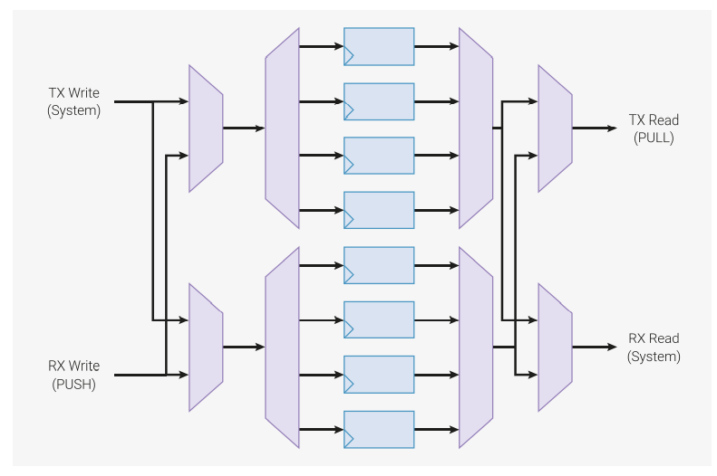

## 3.5. 功能详解


### 3.5.1. Side-set


Side-set 特性可以让状态机在执行主指令的同时，改变最多 5 个管脚的电平或方向。

需要使用 side-set 的例子之一就是高速 SPI 接口，其数据比特从 OSR 推出到 GPIO，而时钟信号转换（从 1 到 0， 或从 0 到 1）必须与此同时发生。
此时，一个带有 side-set 的 `OUT` 就能同时完成两项任务。

这样可以保证接口的时序更精确，减小整体的程序大小（因为不需要独立的 `SET` 指令设置时钟管脚），而且提高了 SPI 能支持的最大频率。

Side-set 还可以让 GPIO 映射更灵活，因为它的映射独立于 `SET` 的映射。示例 I2C 代码在禁止时钟拉伸（clock streching）的情况下，可以将 `SDA` 和 `SCL` 映射到任意管脚上。
正常情况下，SCL 反转用于同步数据传输，而 SDA 包含移出的数据比特。但是，一些特定的 I2C 序列，如 `Start` 和 `Stop` 线条件，需要在 SDA 和 SCL 上产生特定的脉冲。
I2C 通过如下映射来实现这一点：

- Side-set → SCL
- `OUT` → SDA
- `SET` → SDA

这样，状态机就可以在 SDA 上提供两种情况的数据，在 SCL 上提供时钟，或者同时在 SDA 和 SCL 上提供固定的转换，同时依然允许 SDA 和 SCL 被映射到任意两个 GPIO 上。

Side-set 数据编码到每条指令的 `Delay/side-set` 字段。任何指令都可以与 side-set 组合，包括 `OUT PINS`、`SET PINS` 等写入管脚的指令。Side-set 
的管脚映射独立于 `OUT` 和 `SET` 的映射，但它们可以重叠。如果 side-set 和 `OUT` 或 `SET` 同时写入同一个管脚，则采用 side-set 的数据。

**注意** 如果指令进入等待状态，side-set 依然会立即生效。

```
1 .program spi_tx_fast
2 .side_set 1
3 
4 loop:
5     out pins, 1   side 0
6     jmp loop      side 1
```

`spi_tx_fast` 示例展示了 side-set 的两个优势：数据和时钟可以更精确地对齐，并且程序整体上可以更快，本例中每两个系统时钟周期就能输出一比特。程序也可以更小。

使用 side-set 时需要配置四个选项：

1. `Delay/side-set` 字段用于 side-set 而不是延时的 MSB 比特数。通过 `PINCTRL_SIDESET_COUNT` 设置。如果设置为 5，则无法使用延时周期。如果设置为 0，则无法使用 side-set。
2. 是否使用最高比特作为有效位。Side-set 只有在设置了有效位的指令上生效。如果不使用有效位，则当 `SIDESET_COUNT` 不为零时，该状态机上的**所有**指令都会执行 side-set。该选项由 `EXECCTRL_SIDE_EN` 设置。
3. 映射到 side-set 最低比特的 GPIO 编号。由 `PINCTRL_SIDESET_BASE` 设置。
4. side-set 写入到 GPIO 电平还是 GPIO 方向。由 `EXECCTRL_SIDE_PINDIR` 设置。

上述示例中，我们只设置了一个 side-set 比特，每条指令都执行 side-set，因此不需要有效位。`SIDESET_COUNT` 为 1，`SIDE_EN` 为假。`SIDE_PINDIR` 为假，因为我们要驱动时钟信号的高低电平，而不是高低阻抗。`SIDESET_BASE` 为时钟信号对应的 GPIO 管脚编号。


### 3.5.2. 程序折返

PIO 程序通常有一个“外层循环”：在 FIFO 和外部之间传输数据时，它们需要反复执行同样的步骤。最小的示例就是前面的方波示例：

<figure>Pico 示例：https://github.com/raspberrypi/pico-examples/tree/master/pio/squarewave/squarewave.pio 行 7 ~ 12</figure>

```
 7 .program squarewave
 8     set pindirs, 1 ; Set pin to output
 9 again:
10     set pins, 1 [1] ; Drive pin high and then delay for one cycle
11     set pins, 0 ; Drive pin low
12     jmp again ; Set PC to label `again`
```

程序的主题部分设置管脚为高，然后设置为低，从而产生方波的一个周期。然后整个程序进行循环，以产生周期性的输出。跳转指令本身需要一个周期，每个 `set` 指令也需要一个周期，
所以为了保证高低部分的长度相同，`set pins, 1` 指令增加了一个周期的延时，使状态机在执行 `set pins, 0` 指令之前等待一个周期。每次循环总共需要 4 个周期。这里有两个问题：

1. `JMP` 占用了本可用于其他程序的指令内存
2. 执行 `JMP` 所需的额外周期导致最大输出速度降低了*一半*

由于程序计数器（`PC`）超过 31 时会自动折返为 0，因此将整个指令内存填充为 `set pins, 1` 和 `set pins, 0`，就能解决第二个问题，但这样很浪费。
状态机有一个硬件特性，通过配置 `EXECCTRL` 控制寄存器，就能解决大部分情况下的问题。

<figure>Pico示例：https://github.com/raspberrypi/pico-examples/tree/master/pio/squarewave/squarewave_wrap.pio 行 11 ~ 19</figure>

```
11 .program squarewave_wrap
12 ; Like squarewave, but use the state machine's .wrap hardware instead of an
13 ; explicit jmp. This is a free (0-cycle) unconditional jump.
14 
15     set pindirs, 1    ; Set pin to output
16 .wrap_target
17     set pins, 1 [1]   ; Drive pin high and then delay for one cycle
18     set pins, 0 [1]   ; Drive pin low and then delay for one cycle
19 .wrap
```


在执行完程序内存中的一条指令后，状态机会使用以下逻辑更新 `PC`：

1. 如果当前指令为 `JMP`，且 `Condition` 为真，则设置 `PC` 为 `Target`
2. 否则，如果 `PC` 等于 `EXECCTRL_WRAP_TOP`，则设置 `PC` 为 `EXECCTRL_WRAP_BOTTOM`
3. 否则，`PC` 加一，但如果当前值为 31，则设置为 0。

`pioasm` 中的 `.wrap_target` 和 `.wrap` 汇编指示实际上是标签。它们会导出常量，以写入到 `WRAP_BOTTOM` 和 `WRAP_TOP`中。

<figure>Pico示例：https://github.com/raspberrypi/pico-examples/tree/master/pio/squarewave/generated/squarewave_wrap.pio.h 行 1 ~ 37</figure>

```c
// -------------------------------------------------- //
// This file is autogenerated by pioasm; do not edit! //
// -------------------------------------------------- //

#pragma once

#if !PICO_NO_HARDWARE
#include "hardware/pio.h"
#endif

// --------------- //
// squarewave_wrap //
// --------------- //

#define squarewave_wrap_wrap_target 1
#define squarewave_wrap_wrap 2

static const uint16_t squarewave_wrap_program_instructions[] = {
    0xe081, //  0: set    pindirs, 1                 
            //     .wrap_target
    0xe101, //  1: set    pins, 1                [1] 
    0xe100, //  2: set    pins, 0                [1] 
            //     .wrap
};

#if !PICO_NO_HARDWARE
static const struct pio_program squarewave_wrap_program = {
    .instructions = squarewave_wrap_program_instructions,
    .length = 3,
    .origin = -1,
};

static inline pio_sm_config squarewave_wrap_program_get_default_config(uint offset) {
    pio_sm_config c = pio_get_default_sm_config();
    sm_config_set_wrap(&c, offset + squarewave_wrap_wrap_target, offset + squarewave_wrap_wrap);
    return c;
}
#endif
```

这是 PIO 汇编器 `pioasm` 产生的原始输出，它创建了一个默认的 `pio_sm_config` 对象，其中包含了程序代码中的 `WRAP` 寄存器值。
也可以直接初始化控制寄存器字段。


**注意** `WRAP_BOTTOM` 和 `WRAP_TOP` 是 PIO 指令内存中的绝对地址。如果程序加载到某个偏移量，那么必须相应地调整折返地址。

`squarewave_wrap` 示例中插入了延时周期，所以它的行为与原版 `squarewave` 程序完全相同。但由于使用了程序折返，我们现在可以去掉延时，
这样输出的速度就是以前的两倍，同时还能维持高电平和低电平的时间相等。

<figure>Pico示例：https://github.com/raspberrypi/pico-examples/tree/master/pio/squarewave/squarewave_fast.pio 行 12 - 18</figure>

```
12 .program squarewave_fast
13 ; Like squarewave_wrap, but remove the delay cycles so we can run twice as fast.
14     set pindirs, 1    ; Set pin to output
15 .wrap_target
16     set pins, 1       ; Drive pin high
17     set pins, 0       ; Drive pin low
18 .wrap
```


### 3.5.3. FIFO 合并

默认情况下，每个状态机拥有两个 4 字长的 FIFO：一个用于将数据从系统传送到状态机（TX），一个用于反方向（RX）。但是，很多程序并不需要系统和状态机之间的双向数据传输，
而更长的 FIFO 却很有用，特别是在 DPI 这种高带宽的接口中。在这些情况下，可以通过 `SHIFTCTRL_FJOIN` 选项将两个 4 字长的 FIFO 合并为一个 8 字长的 FIFO。

|  |
|:--:|
| 图42. 可合并的双 FIFO。每个 FIFO 为 4 字长，包括 4 个数据寄存器、一个 1：4 解码器和一个 4:1 多路复用器。多路复用可以在 TX 和 RX 通道之间进行写数据和读数据操作，这样所有 8 个字都可以从两个端口进行访问。 |

另一个用例是 UART。由于 UART 的 TX/CTS 和 RX/RTS 部分是异步的，因此它们是在两个独立的状态机上实现的。而让每个状态机的一半 FIFO 资源空闲，是一种浪费。
由于我们可以将两个 FIFO 合并成一个 TX FIFO 供 TX/CTS 状态机使用，或者合并成一个 RX FIFO 供 RX/RTS 状态机使用，这样就能利用全部资源。
而拥有 8 字深 FIFO 的 UART 能够处理的中断数量是 4 字深 FIFO 的 UART 的两倍。

增加 FIFO 的深度（从 4 增加到 8）后，同一个状态机中的另一个 FIFO 的大小就变为零。例如，如果将 FIFO 合并供 TX 使用，那么就无法使用 RX FIFO，任何 `PUSH` 指令都会陷入等待状态。
在 `FSTAT` 寄存器中，RX FIFO 同时表现为 `RXFULL` 和 `RXEMPTY` 状态。而合并到 RX 的情况正相反：TX FIFO 不可用，该状态机的 `FSTAT` 中 `TXFULL` 和 `TXEMPTY` 比特均为设置状态。

只要 DMA 没有因为其他竞合状态而变慢，那么 8 字 FIFO 足够通过 RP2040 的 DMA 实现每个周期 1 字的速率。

**注意** 改变 `FJOIN` 会抛弃当前状态机的 FIFO 中的一切数据。如果数据不能恢复，那么必须事先清空 FIFO 队列。


### 3.5.4. 自动推出和自动加载

